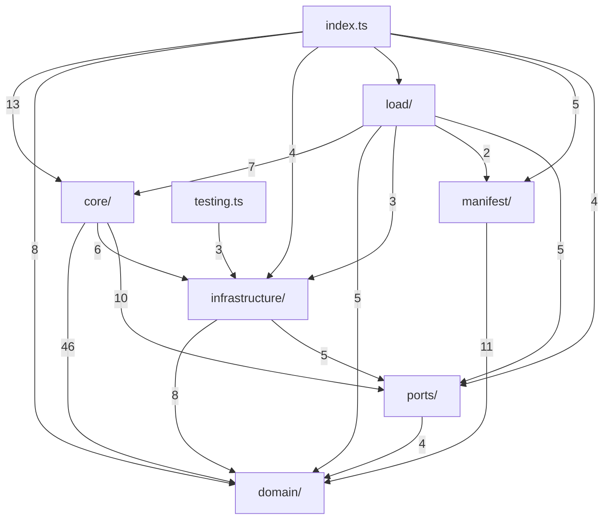

The manifest is a diagram of the _designed_ architecture. It is not a diagram of the
codebase, and cannot be: a node like `"src/"` governs six tiers through one allowlist,
`"**/": { layout: open }` claims every folder the tree does not name, and `~/*/src/**`
selects every package's source with one glob. A picture drawn from the manifest alone
shows the rules and none of the files they apply to.

`diagram` draws the tree as it is — every file the walker sees, every edge the resolver
resolves, rolled up to the folder you are looking at — with the manifest laid over it,
saying which of those edges the policy admits, which it forbids, and which it has nothing
to say about.

```bash
architecture diagram [--root <folder>] [--depth 1|2] [--focus <file>]... [--designed] [--outside] [roots…]
```

## What it draws

Every folder is a diagram of its children. The folder is `--root`; absent, it is the
folder every `--focus` file shares, else the one walk root. Each child — a subfolder, or a
file directly in it — is a node; every import between two children is one edge, counted,
and its arrow is its status under the policy:

| arrow             | status       | meaning                                                                                                   |
| ----------------- | ------------ | --------------------------------------------------------------------------------------------------------- |
| `-->`             | `admitted`   | The importer is under an import allowlist and an allowance matched the target.                            |
| `==>` red         | `violation`  | An import rule fired, or an `exports` rule about a name carried across the edge. The worst of the pair.   |
| `-.->` amber      | `ungoverned` | No import allowlist selects the importer, so the policy has nothing to say about the edge.                |
| `-. designed .->` | `designed`   | With `--designed`: an allowance nothing imports through — slack — drawn from the files it is in force at. |

A rolled-up edge takes the worst status of the imports beneath it. A node's label is its
last path segment, with `⚠ n` for the violations under it that the baseline does not carry
and `↻` when a cycle runs through it. Node ids are the paths themselves, so a diff of two
renders is a diff of the architecture.

`--depth 2` draws each child folder as a subgraph holding its own children, and runs the
edges between those. `--outside` draws where the edges leaving the folder go: the nearest
sibling of an ancestor, named relative to the folder (`../core/`), or the package
(`effect`) or runtime module (`node:fs`), each in a dashed box. Without it, an edge leaving
the folder is not drawn.

Nothing in the output is a directive GitHub's renderer drops — no `click`, no theme, no
tooltip — so the text pastes into a pull request comment or a job summary as it is.

## Where it comes from

The render is two pure functions in `@goodbones/core` over the
[atlas](/goodbones/architecture-rules/enforcement/cli/#atlas): `viewOf` rolls the atlas up
to one folder, and `renderMermaid` writes the text. Nothing in either decides what an edge
means. An edge is a violation because the evaluator `check` runs said so, and it is
admitted by the allowance the [conformance](/goodbones/architecture-rules/enforcement/conformance/)
report would count as used. The diagram lifts those answers; it does not re-derive them.

## This repository

```bash
architecture diagram --root packages/core/src packages
```



Six tiers and two barrels, with exactly the edges [the core's manifest](https://github.com/dataquail/goodbones/blob/main/packages/core/architecture.yaml)
allows and nothing red. Plant `import "../infrastructure/file-system-live.js"` in
`core/imports.ts` and one thick edge appears from `core/` to `infrastructure/`; that is
the picture a pull request check posts.
